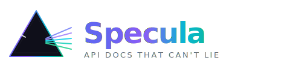

<p align="center">
  
</p>

<p align="center">
  <a href="https://github.com/elvinaqalarov99/spectra/releases"></a>
  <a href="LICENSE"></a>
  <a href="https://pkg.go.dev/github.com/elvinaqalarov99/spectra"></a>
  
</p>

---

# Spectra

> **API docs that can't lie.**

Spectra is a zero-annotation, traffic-driven API documentation engine. Instead of asking developers to write and maintain OpenAPI annotations that inevitably rot, Spectra sits between your HTTP client and server, observes real traffic, and builds a living OpenAPI 3.0 specification from what your API *actually does* — not what someone hoped it would do.

---

## The Problem

Every annotation-based documentation tool shares the same fundamental flaw: it trusts the developer to keep it updated. As the codebase evolves, annotations drift. New fields go undocumented. Removed endpoints linger in the spec. The docs become a liability instead of an asset.

Spectra solves this at the source. It watches what your API does and builds the spec automatically. There is no annotation to forget. There is no step to skip.

---

## How It Works

```
Your App  ──►  Spectra Proxy (:9999)  ──►  Upstream Server (:3000)
                      │
                      ▼
               Inference Engine
            (path normalizer + schema merger)
                      │
                      ▼
             Live OpenAPI 3.0 Spec
                      │
               ┌──────┴──────┐
               ▼             ▼
          REST API       WebSocket
           /spec            /ws
               │             │
               └──────┬──────┘
                      ▼
              Swagger UI (/docs)
              Auto-refreshes live
```

Every request that flows through the proxy or an SDK middleware is captured, normalised, and merged into the spec in real time. Open `/docs` and watch your API document itself as you run your test suite or click through your app.

---

## Modes of Operation

Spectra ships as three things that work together or independently.

### 1. Dev Proxy

A local HTTP proxy that your app or HTTP client routes through during development. Fully transparent — requests and responses are not modified in any way.

```bash
spectra start --target http://localhost:3000 --proxy :9999 --ui :7878
```

Point your HTTP client at `http://localhost:9999` instead of your server. That's the entire integration.

### 2. Framework SDK Middleware

For teams who prefer not to run a separate proxy process. Install a small package that hooks into your framework's request lifecycle and ships observations to the Spectra server.

**NestJS**
```typescript
// main.ts — two lines
import { SpectraModule } from '@spectra/nestjs';
app.use(SpectraModule.middleware({ endpoint: 'http://localhost:7878' }));
```

**Laravel**
```php
// config/app.php — add the provider
Spectra\Laravel\SpectraServiceProvider::class,

// or manually in AppServiceProvider
Spectra::observe();
```

Observations are sent fire-and-forget over a non-blocking connection. The middleware never adds latency to your responses.

### 3. CI Spec Drift Check

Keeps your committed `openapi.json` honest forever. Run your test suite through the proxy, then compare the live-observed spec against what's in source control.

```bash
# Fail the build if the API has drifted from the committed spec
spectra diff --committed openapi.json --live http://localhost:7878
```

Exit code `0` means no drift. Exit code `1` means the spec is stale and lists every change. Wire it into your CI pipeline and the docs stay current as a side effect of running tests.

---

## Architecture

```
spectra/
├── cli/                   CLI entry point (start, export, diff)
├── proxy/                 Transparent HTTP reverse proxy
├── inference/
│   ├── schema.go          JSON value → JSONSchemaType inference
│   ├── stringformat.go    Format detection (uuid, date-time, email, uri…)
│   ├── normalizer.go      Path trie — /users/42 → /users/{id}
│   └── merger.go          Incremental OpenAPI spec builder
├── server/
│   ├── server.go          HTTP API + WebSocket hub
│   ├── ingest.go          POST /ingest — SDK observation receiver
│   ├── websocket.go       RFC 6455 WebSocket (zero dependencies)
│   └── swaggerui.go       Embedded Swagger UI with live reload
├── assets/                Brand assets (logo.svg, icon.svg)
└── sdks/
    ├── nestjs/            TypeScript middleware for NestJS / Express
    └── laravel/           PHP middleware + ServiceProvider for Laravel
```

---

## The Inference Engine

### Path Normalisation

The hardest engineering problem in this domain is deciding when a path segment is a literal versus a parameter. Spectra builds a trie of all observed paths and promotes a segment to `{id}` when it sees two or more distinct values at the same structural position that match ID patterns (numeric, UUID, or long slug).

```
Observed:          Normalised:
/users/1           /users/{id}
/users/42          /users/{id}
/users/99          /users/{id}
/users/me          /users/me        ← literal preserved
/users/1/posts/10  /users/{id}/posts/{id}
```

### Schema Merging

Each observation is a delta. The merger applies a set of widening rules:

| Situation | Result |
|---|---|
| Same field, same type | Types merged deeply |
| Same field, different types | `oneOf: [typeA, typeB]` |
| Field present in all observations | `required: true` |
| Field missing from some observations | `required: false` |
| New field never seen before | Added, flagged as undocumented |
| `integer` observed then `number` | Widened to `number` |

### Format Detection

String values are inspected for semantic formats automatically:

| Pattern | Format |
|---|---|
| `550e8400-e29b-41d4-...` | `uuid` |
| `2024-01-15T10:30:00Z` | `date-time` |
| `2024-01-15` | `date` |
| `user@example.com` | `email` |
| `https://...` | `uri` |
| `192.168.1.1` | `ipv4` |

---

## CLI Reference

```
spectra <command> [flags]

Commands:
  start    Start the proxy and docs server
  export   Export the current spec to a file
  diff     Compare a committed spec against the live one

Flags — start:
  --target   Upstream server URL        (default: http://localhost:3000)
  --proxy    Proxy listen address       (default: :9999)
  --ui       Docs server listen address (default: :7878)
  --title    API title in the spec      (default: "My API")

Flags — export:
  --from     Running Spectra server URL (default: http://localhost:7878)
  --out      Output file path           (default: openapi.json)

Flags — diff:
  --committed  Path to committed spec file   (default: openapi.json)
  --live       Running Spectra server URL    (default: http://localhost:7878)
```

---

## API Endpoints

The Spectra server exposes a small API alongside the documentation UI.

| Endpoint | Method | Description |
|---|---|---|
| `/docs/` | `GET` | Swagger UI — live-updating |
| `/spec` | `GET` | Current OpenAPI 3.0.3 spec as JSON |
| `/spec.yaml` | `GET` | Same spec, YAML content-type |
| `/ingest` | `POST` | Receive an observation from an SDK middleware |
| `/ws` | `GET` | WebSocket — pushes `spec_update` events |
| `/health` | `GET` | Health check — returns `ok` |

### WebSocket Events

```json
{
  "event": "spec_update",
  "path": "/users/{id}",
  "spec": { ... }
}
```

The Swagger UI subscribes to this stream and calls `ui.specActions.updateSpec()` whenever a new event arrives — no page reload required.

---

## SDK Integration

### NestJS / Express

```bash
npm install @spectra/nestjs
```

```typescript
// main.ts
import { SpectraModule } from '@spectra/nestjs';

const app = await NestFactory.create(AppModule);
app.use(SpectraModule.middleware({
  endpoint: 'http://localhost:7878',
  ignore: ['/health', '/metrics'],
  captureBodies: true,
}));
```

Observations are sent via `fetch` with a 2-second timeout, fire-and-forget. If the Spectra server is unreachable, the error is swallowed silently — your production traffic is never affected.

### Laravel

```bash
composer require spectra/laravel
```

Register the service provider (auto-discovered in Laravel 11+):

```php
// config/app.php
'providers' => [
    Spectra\Laravel\SpectraServiceProvider::class,
],
```

Publish and edit the config:

```bash
php artisan vendor:publish --tag=spectra-config
```

```php
// config/spectra.php
return [
    'enabled'        => env('SPECTRA_ENABLED', true),
    'endpoint'       => env('SPECTRA_ENDPOINT', 'http://localhost:7878'),
    'ignore'         => ['/health', '/metrics', '/telescope'],
    'capture_bodies' => env('SPECTRA_CAPTURE_BODIES', true),
];
```

Observations are sent via a non-blocking raw socket — zero overhead on the response path.

---

## CI/CD Integration

### GitHub Actions

```yaml
name: API Spec Drift Check

on: [push, pull_request]

jobs:
  drift:
    runs-on: ubuntu-latest
    steps:
      - uses: actions/checkout@v4

      - name: Start application
        run: docker compose up -d

      - name: Start Spectra proxy
        run: |
          curl -sSL https://github.com/elvinaqalarov99/spectra/releases/latest/download/spectra-linux-amd64 -o spectra
          chmod +x spectra
          ./spectra start --target http://localhost:3000 --proxy :9999 --ui :7878 &
          sleep 2

      - name: Run test suite through proxy
        run: TEST_BASE_URL=http://localhost:9999 npm test

      - name: Check for spec drift
        run: ./spectra diff --committed openapi.json --live http://localhost:7878
```

Once this check is in your pipeline, the spec stays honest as a free side effect of running your tests. Teams that adopt this never remove it.

---

## Design Decisions

**No external dependencies in the Go core.**
The proxy, inference engine, server, and WebSocket implementation are written against the Go standard library only. No gorilla/websocket, no chi, no gorm. This keeps the binary small, the build reproducible, and the attack surface minimal.

**Fire-and-forget observation delivery.**
SDK middlewares never block the response path. If the Spectra server is unavailable, observations are dropped silently. The contract is: Spectra observes your API, it never affects it.

**Trie-based path normalisation over regex.**
A naïve regex approach (`\d+` → `{id}`) produces false positives on things like version prefixes (`/v2/`) and port numbers in URLs. The trie approach considers structural context — a segment is only promoted to a parameter when multiple distinct values appear at the same position across different requests.

**Required = intersection, not union.**
A field is marked `required` only when it appears in every observation of that endpoint. If a field is absent from even one response, it becomes optional. This is the conservative, correct default for a tool that builds specs from incomplete traffic samples.

---

## Roadmap

- [ ] Django middleware SDK
- [ ] Express.js standalone middleware SDK
- [ ] Field-level diff in `spectra diff` (not just path presence)
- [ ] `--threshold` flag: flag endpoints seen fewer than N times as draft
- [ ] Authentication header scrubbing (redact `Authorization`, `Cookie` values)
- [ ] Export to Postman collection format
- [ ] Graph view UI — visualise endpoint relationships and call frequency

---

## License

MIT — see [LICENSE](LICENSE).

---

*Maintained with the philosophy that the best documentation system is one developers never have to think about.*
